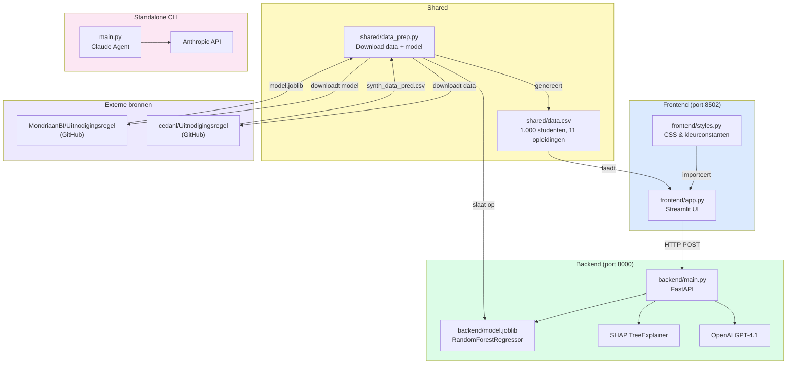
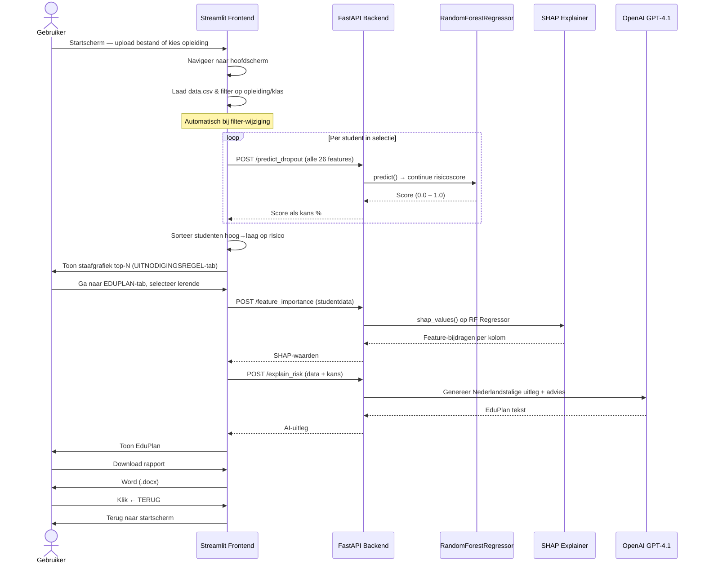

# Conceptueel model EduPlan

## Architectuur en Workflow

### Aanleiding
Onderwijsinstellingen worstelen al jaren om meer grip op uitval te krijgen. Steeds vaker wordt hierbij gebruik gemaakt van data over de studieontwikkeling van studenten.

In haar promotieonderzoek introduceerde Irene Eegdeman een methode om studenten met een verhoogd risico op uitval vroegtijdig te signaleren. Met behulp van studiedata en machine learning-modellen is de zogenaamde 'uitnodigingsregel' ontwikkeld. Deze methode biedt SLB'ers en mentoren een signaleringssysteem om uitvalpreventie en -interventies effectiever in te zetten.

### Doel
Een intelligente webservice die zelfstandig taken kan uitvoeren en vragen kan beantwoorden op basis van MBO-studentdata. In de eerste fase ligt ***de focus op enerzijds het voorspellen en signaleren van potentieel studentuitval, anderzijds op het ondersteunen van interventies om uitval te voorkomen.***

We maken gebruik van het werk dat heeft geleid tot **"de Uitnodigingsregel"** (MondriaanBI / Irene Eegdeman). Op basis van voorspelmodellen wordt gesignaleerd welke studenten een hoge kans op uitval hebben, waarna deze studenten worden uitgenodigd voor een "interventie"-gesprek met een SLB-er.

### Productschets

Een agentic webservice/app die zelfstandig taken kan uitvoeren en vragen kan beantwoorden op basis van MBO-studentdata. We richten ons op het voorspellen van uitval, het verklaren van deze voorspelling, en het genereren van mogelijke interventies, gepresenteerd in een downloadbaar Word-rapport (EduPlan).

De app bestaat uit twee processen:
- **Streamlit** (`frontend/app.py`, port 8502): interactieve gebruikersinterface met startscherm en hoofdscherm.
- **FastAPI** (`backend/main.py`, port 8000): backend API-endpoints voor ML-voorspellingen, SHAP-analyse en LLM-calls.

Daarnaast bevat het project een losstaande CLI-agent (`main.py`) op basis van de Anthropic Claude API.

---

## Conceptueel Model voor uitvalsignalering en interventie

1. **Dataverzameling**

    - **Bronnen:**
        - Synthetische studentdata (`shared/data.csv`) gebaseerd op de Uitnodigingsregel-structuur: **1.000 studenten** verdeeld over **11 opleidingen**.
        - Optioneel: eigen databestand uploaden via de app (.csv of .xlsx).

        | Variabele | Uitleg |
        |-----------|--------|
        | `Studentnummer` | Uniek studentnummer |
        | `Naam` | Naam van de student (synthetisch) |
        | `Opleiding` | Naam van de opleiding (bijv. Kapper, Kok, Verzorgende) |
        | `Klas` | Klasaanduiding (bijv. 1A, 2B) |
        | `Mentor` | Naam van de mentor (synthetisch) |
        | `StudentAge` | Leeftijd student |
        | `StudentGender` | Geslacht (binair) |
        | `Aanmel_aantal` | Aantal aanmeldingen |
        | `max1studie` | Maximaal één studie tegelijk (binair) |
        | `absence_unauthorized` | Ongeoorloofd verzuim |
        | `absence_authorized` | Geoorloofd verzuim |
        | `VooroplNiveau_*` | Vooropleidingsniveau (binaire kolommen) |
        | `Economie`, `Techniek`, `DSV`, `Zorgenwelzijn`, … | Sector (binaire kolommen) |
        | `ROCMondriaan` | Instelling (binair) |
        | `Dropout` | Uitvallabel 0/1 |

        Later kunnen we uitbreiden met data uit kernregistratiesystemen (Eduarte, Osiris), LMS-systemen en toetsresultaten.

2. **Data-integratie en Preprocessing**
    - Data wordt gedownload en voorbereid via `shared/data_prep.py`.
    - Het voorgetrainde model (`backend/model.joblib`) is een **RandomForestRegressor** van MondriaanBI.
    - Features worden dynamisch bepaald vanuit `data.csv` (alle kolommen behalve `Dropout`, `Naam`, `Opleiding`, `Klas`, `Mentor`).

3. **Analytics Engine**

    - **Predictieve Analyse:** Continue risicoscore (0–1) per student via de RandomForestRegressor. Geen vaste drempelwaarde — studenten worden gerangschikt van hoogste naar laagste risico.
    - **Diagnostische Analyse:** SHAP TreeExplainer geeft inzicht in de bijdrage van elke variabele aan de voorspelling.
    - **Prescriptieve Analyse:** OpenAI GPT-4.1 genereert een Nederlandstalige uitleg en mentoradvies (EduPlan).

4. **Visualisatie en Interactie**

    - **Startscherm:** Upload-veld, zoekbalk, snelkeuze-opleidingen.
    - **Hoofdscherm:** Lichtroze header met navigatieknoppen (← TERUG / UITNODIGINGSREGEL / EDUPLAN).
    - **UITNODIGINGSREGEL-tab:** Horizontale staafgrafiek — top-N studenten gesorteerd hoog→laag op risico.
    - **EDUPLAN-tab:** Selecteer een student → genereer Nederlandstalig AI-advies → download als Word (.docx).
    - **Export:** EduPlan als Word-rapport (.docx).

5. **Stakeholders en Feedback Loop**

    - **Gebruikers:** Docenten/Mentoren/SLB-ers (gerichte interventies), onderwijsadministratie (beleidsvorming).
    - **Feedback Loop:** Interventies worden gemonitord zodat het model continu geoptimaliseerd kan worden.

---

# Architectuur EduPlan

## 1. Dataverzameling & Preprocessing

**Bronnen:**
- Synthetische data van [cedanl/Uitnodigingsregel](https://github.com/cedanl/Uitnodigingsregel) (`synth_data_pred.csv`).
- Voorgetraind model van [MondriaanBI/Uitnodigingsregel](https://github.com/MondriaanBI/Uitnodigingsregel) (`random_forest_regressor.joblib`).

**Preprocessing stappen (in `data_prep.py`):**
1. Download `synth_data_pred.csv` van cedanl/Uitnodigingsregel.
2. Download `random_forest_regressor.joblib` van MondriaanBI/Uitnodigingsregel → sla op als `backend/model.joblib`.
3. Voeg synthetische kolommen `Naam`, `Klas`, `Mentor` en `Opleiding` toe.
4. Sla op als `shared/data.csv` (1.000 studenten).

---

## 2. Opslag en Data-Integratie

| Component | Technologie |
|-----------|-------------|
| **Studentdata** | `shared/data.csv` (1.000 rijen, CSV, 11 opleidingen) |
| **ML-model** | `backend/model.joblib` (RandomForestRegressor, joblib) |

---

## 3. AI & Analytics

**Analytics functionaliteiten:**

1. **Uitval voorspellen**
   - Continue risicoscore (0.0–1.0) per student via `model.predict()`.
   - Alle studenten worden gerangschikt van hoogste naar laagste risico — geen vaste drempelwaarde.

2. **Feature importance via SHAP**
   - SHAP TreeExplainer op de RandomForestRegressor geeft per feature de bijdrage aan de risicoscore.
   - Output heeft shape `(n_samples, n_features)` — geen `[1]` class-index nodig.

3. **Generatieve AI (OpenAI GPT-4.1)**
   - **EduPlan:** Nederlandstalige uitleg waarom een student risico loopt, met advies voor de mentor.
   - **Managementsamenvatting:** Samenvatting van studentdata voor het management.

**Gebruikte technieken:**
- **Predictive Modeling** (scikit-learn RandomForestRegressor) → continue risicoscore.
- **SHAP** → feature importance verklaren.
- **Generatieve AI (OpenAI GPT-4.1)** → uitleg, advies en samenvatting.

---

## 4. Interactie

**Gebruikers:** Docenten/SLB-ers (signalering, monitoring, interventies).

**Functionaliteiten:**
- ✅ Eigen databestand uploaden (.csv / .xlsx)
- ✅ Opleiding selecteren via zoekbalk of snelkeuze-pills
- ✅ Uitval voorspellen per student (bulk, automatisch bij filter-wijziging)
- ✅ UITNODIGINGSREGEL-tab: staafgrafiek top-N risicostudenten
- ✅ EDUPLAN-tab: Nederlandstalig AI-advies per student
- ✅ Download EduPlan als Word (.docx)
- ✅ Terugkeren naar startscherm via ← TERUG knop

**Tech Stack:** Streamlit (frontend), FastAPI (backend), OpenAI GPT-4.1 (AI), scikit-learn + SHAP (ML), streamlit-extras (bottom container).

---

# Dataflow & Architectuurdiagram



### Sequentiediagram (gebruikersflow)



---

# Code-structuur

## Projectstructuur (actueel)

```
eduplan/
│
├── backend/
│   ├── __init__.py
│   ├── main.py          # FastAPI backend: ML- & AI-endpoints
│   ├── model.joblib     # RandomForestRegressor (Uitnodigingsregel, MondriaanBI)
│   └── README.md
│
├── frontend/
│   ├── app.py           # Streamlit UI — startscherm + hoofdscherm
│   ├── styles.py        # CSS-constanten en kleurconstanten
│   └── ui.py            # (ongebruikt)
│
├── shared/
│   ├── data.csv         # 1.000 synthetische studenten, 11 opleidingen
│   ├── data_prep.py     # Download data + model van GitHub
│   ├── synth_data_pred.csv  # Ruwe download (tussenstap)
│   └── README.md
│
├── agents/              # map voor toekomstige agents
│   └── README.md
│
├── assets/
│   ├── npuls_logo.png
│   ├── achtergrond.png
│   └── README.md
│
├── docs/
│   └── architectuur.md  # Mermaid diagrammen (schermstructuur + flow)
│
├── main.py              # Standalone Claude CLI-agent (Anthropic API)
│
├── CLAUDE.md            # Instructies voor Claude Code
├── README.md
├── pyproject.toml
├── uv.lock
├── 1_start_fastapi.sh / 1_start_fastapi.bat
└── 2_start_streamlit.sh / 2_start_streamlit.bat
```

---

## Backend endpoints (`backend/main.py`)

| Endpoint | Input | Doel |
|----------|-------|------|
| `POST /predict_dropout` | Alle modelfeatures (dict, 26 kolommen) | Continue risicoscore (0–1) via RandomForestRegressor |
| `POST /explain_risk` | Studentdata + uitvalskans | Nederlandstalige AI-uitleg + mentoradvies via GPT-4.1 |
| `POST /feature_importance` | Studentdata | SHAP-waarden per feature (TreeExplainer op regressor) |
| `POST /summarize` | CSV-string of vrije vraag | Managementsamenvatting of Q&A via GPT-4.1 |

- **ML-model:** `RandomForestRegressor` geladen uit `backend/model.joblib` via `joblib.load()`
- **Features:** Dynamisch bepaald vanuit `shared/data.csv` (alle kolommen behalve `Dropout`, `Naam`, `Opleiding`, `Klas`, `Mentor`)
- **Invoer:** Altijd `.values` doorgeven (model getraind zonder feature-namen)
- **SHAP:** `TreeExplainer` op regressor → shape `(n_samples, n_features)`, geen `[1]` index
- **Geen drempelwaarde:** Alle studenten worden teruggegeven; frontend sorteert hoog→laag

## Frontend (`frontend/app.py` + `frontend/styles.py`)

**Startscherm (`page = "start"`):**
- Upload-veld (.csv / .xlsx) — gecentreerd, smaller
- Zoekbalk + START-knop
- Snelkeuze-pills (4 zichtbaar + "Meer ↓")
- Checkbox om opleiding te onthouden
- Roze achtergrond (`#e8c8c8`), compacte sticky footer

**Hoofdscherm (`page = "main"`):**
- Lichtroze sticky header (`#f2e4e4`) via CSS `:has(> [data-testid="stHorizontalBlock"])`
  - CEDA logo links
  - Drie knoppen rechts: **← TERUG**, **UITNODIGINGSREGEL** (actief = zwart/wit), **EDUPLAN**
- Witte kaart (`border=True`) met:
  - Kaart-header: opleiding + KLAS selectbox + potlood-knop
  - Terracotta banner: slider voor top-N (default 10)
  - UITNODIGINGSREGEL-tab: horizontale Plotly staafgrafiek
  - EDUPLAN-tab: student-selector → AI-uitleg → DOWNLOAD (.docx)
- Compacte lichtroze sticky footer (CC BY-SA 4.0 licentieregel)

**CSS-kleuren (`frontend/styles.py`):**

| Constante | Hex | Gebruik |
|-----------|-----|---------|
| `TERRACOTTA` | `#c8785a` | Bannerkleuren |
| `ROZE_BG` | `#e8c8c8` | Pagina-achtergrond, bottom startscherm |
| `ROZE_LICHT` | `#f2e4e4` | Header hoofdscherm, bottom hoofdscherm |

## Standalone Claude Agent (`main.py`)

Een losstaande CLI-tool die **niet** deel uitmaakt van de webapplicatie.

- **API:** Anthropic Claude (`claude-sonnet-4-6`)
- **Tools:** `read_file`, `list_files`, `edit_file`
- **Doel:** Interactieve coding-assistent die bestanden kan lezen en bewerken
- **Vereist:** `ANTHROPIC_API_KEY` environment variabele

---

# Installeren en draaien

## Vereisten

- Python 3.13+
- [UV package manager](https://docs.astral.sh/uv/) (aanbevolen) of pip
- `OPENAI_API_KEY` environment variabele (voor de webapplicatie)
- `ANTHROPIC_API_KEY` environment variabele (alleen voor `main.py`)

## Installatie

```bash
cd eduplan
uv sync
# of: pip install -r requirements.txt
```

## Data en model downloaden (éénmalig)

```bash
python shared/data_prep.py
```

Dit downloadt `shared/data.csv` (1.000 studenten) en `backend/model.joblib` van GitHub.

## Starten

```bash
# Terminal 1 — FastAPI backend (port 8000)
./1_start_fastapi.sh
# of Windows: 1_start_fastapi.bat
# of: uv run uvicorn --host 127.0.0.1 --port 8000 backend.main:app --reload

# Terminal 2 — Streamlit frontend (port 8502)
./2_start_streamlit.sh
# of Windows: 2_start_streamlit.bat
# of: uv run streamlit run --server.port 8502 frontend/app.py
```

## Standalone Claude agent

```bash
python main.py
```

---

# Voorbeeld: kerncode

## FastAPI backend (`backend/main.py`)

```python
from fastapi import FastAPI
from pydantic import BaseModel
import pandas as pd
import joblib
import shap
from openai import OpenAI
import os

app = FastAPI()
client = OpenAI()
MODEL = "gpt-4.1"

clf = joblib.load("backend/model.joblib")

# Features dynamisch bepaald vanuit data.csv
NON_FEATURES = {"Dropout", "Naam", "Opleiding", "Klas", "Mentor"}
df = pd.read_csv("shared/data.csv")
features = [c for c in df.columns if c not in NON_FEATURES]

explainer = shap.TreeExplainer(clf)

class StudentData(BaseModel):
    student: dict

class ExplainRequest(BaseModel):
    student: dict
    probability: float

@app.post("/predict_dropout")
def predict_dropout(request: StudentData):
    X = pd.DataFrame([request.student])[features].values
    score = float(clf.predict(X)[0])
    return {"probability": score}

@app.post("/explain_risk")
def explain_risk(request: ExplainRequest):
    feature_str = ", ".join([f"{k}: {v}" for k, v in request.student.items()])
    prompt = (
        f"Studentgegevens: {feature_str}.\n"
        f"Voorspelde kans op uitval: {request.probability:.2%}.\n"
        f"Licht in heldere taal toe waarom deze student risico loopt, "
        f"en geef gericht advies aan de mentor."
    )
    response = client.chat.completions.create(
        model=MODEL,
        messages=[{"role": "user", "content": prompt}]
    )
    return {"explanation": response.choices[0].message.content}

@app.post("/feature_importance")
def feature_importance(request: StudentData):
    X = pd.DataFrame([request.student])[features].values
    shap_vals = explainer.shap_values(X)   # shape: (n_samples, n_features)
    fi = dict(zip(features, shap_vals[0].tolist()))
    return {"feature_importance": fi}
```

## Streamlit frontend — schermrouter (`frontend/app.py`)

```python
import streamlit as st
from streamlit_extras.bottom_container import bottom
from styles import START_CSS, MAIN_CSS, TERRACOTTA, ROZE_LICHT

# Session state defaults
_defaults = {
    "page": "start",
    "selected_opleiding": "Alle",
    "actieve_tab": "uitnodigingsregel",
    "top_n": 10,
    "uploaded_df": None,
}
for k, v in _defaults.items():
    st.session_state.setdefault(k, v)

# Router
if st.session_state.page == "start":
    show_start_screen()
else:
    show_main_screen()

# Sticky footer (altijd zichtbaar)
with bottom():
    st.markdown(
        """<p style="text-align:center; font-size:0.7rem; font-weight:500; color:gray;
                    font-family:'General Sans',sans-serif; margin:4px 0;">
            &#169; 2026 CEDA — CC BY-SA 4.0 · AI en data waarde(n)vol inzetten: CEDA.
            Uitnodigingsregel – EduPlan. Utrecht: Npuls
        </p>""",
        unsafe_allow_html=True,
    )
```

## Header hoofdscherm met navigatieknoppen

```python
def _render_header():
    tab = st.session_state.actieve_tab

    col_ceda, col_terug, col_ur, col_ep = st.columns([3, 1.2, 2.2, 1.2])

    with col_ceda:
        st.markdown("<p style='font-weight:700;font-size:1.5rem;...'>CEDA</p>",
                    unsafe_allow_html=True)
    with col_terug:
        if st.button("← TERUG", key="nav_terug", use_container_width=True):
            st.session_state.page = "start"
            st.rerun()
    with col_ur:
        if st.button("UITNODIGINGSREGEL", key="nav_ur",
                     type="primary" if tab == "uitnodigingsregel" else "secondary",
                     use_container_width=True):
            st.session_state.actieve_tab = "uitnodigingsregel"
            st.rerun()
    with col_ep:
        if st.button("EDUPLAN", key="nav_ep",
                     type="primary" if tab == "eduplan" else "secondary",
                     use_container_width=True):
            st.session_state.actieve_tab = "eduplan"
            st.rerun()
```

CSS (in `styles.py`) zorgt voor de lichtroze achtergrond via:
```css
div.block-container > div > [data-testid="stVerticalBlock"]
    > div:has(> [data-testid="stHorizontalBlock"]) {
    background-color: #f2e4e4 !important;
    position: sticky !important;
    top: 0 !important;
    z-index: 9999 !important;
}
```

---

# Aanpak productiesetup

1. **Model serialisatie**
   - Model opgeslagen als `backend/model.joblib` via `joblib.dump()`.
   - Features dynamisch bepaald vanuit `data.csv` — geen hardcoded lijst nodig.

2. **Service-laag**
   - FastAPI met vier endpoints: `/predict_dropout`, `/explain_risk`, `/feature_importance`, `/summarize`.
   - Pydantic validatie van inkomende JSON (ingebouwd in FastAPI).

3. **Deployment**
   - Docker-container voor een consistente omgeving.
   - Reverse proxy (bijv. Nginx) voor SSL-terminatie en load balancing.
   - Monitor CPU/RAM, logs en API-latency.

4. **Client-gebruik**
   - Streamlit-frontend communiceert via `requests.post(...)` met de FastAPI-backend.
   - Externe clients kunnen eveneens via HTTP JSON versturen en de voorspelling ontvangen.

Met deze aanpak heb je een duurzame productiesetup:
- Een duidelijk geserialiseerd model (joblib).
- Een eenvoudige, schaalbare API.
- De mogelijkheid om later te upgraden (andere voorspelmodellen, batch-voorspellingen, authenticatie, RAG voor interventieadvies).
