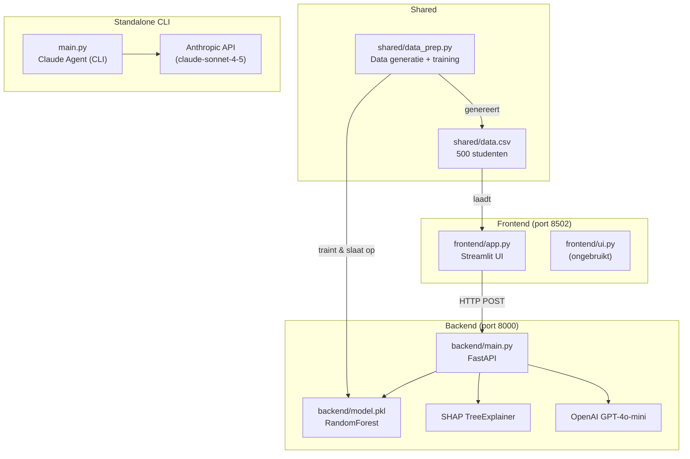
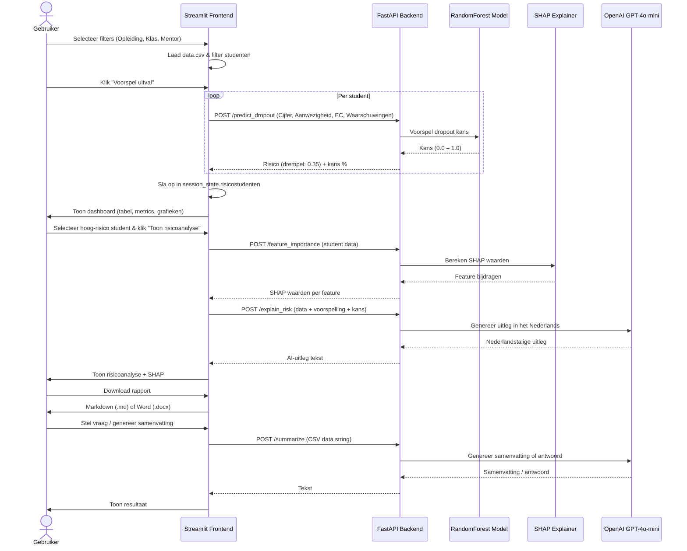

# Conceptueel model EduPlan

## Architectuur en Workflow

### Aanleiding
Onderwijsinstellingen worstelen al jaren om meer grip op uitval te krijgen. Steeds vaker wordt hierbij gebruik gemaakt van data over de studieontwikkeling van studenten.

In haar promotieonderzoek introduceerde Irene Eegdeman een methode om studenten met een verhoogd risico op uitval vroegtijdig te signaleren. Met behulp van studiedata en machine learning-modellen is de zogenaamde 'uitnodigingsregel' ontwikkeld. Deze methode biedt SLB'ers en mentoren een signaleringssysteem om uitvalpreventie en -interventies effectiever in te zetten.

### Doel
Een intelligente webservice die zelfstandig taken kan uitvoeren en vragen kan beantwoorden op basis van MBO-studentdata. In de eerste fase ligt ***de focus op enerzijds het voorspellen en signaleren van potentieel studentuitval, anderzijds op het ondersteunen van interventies om uitval te voorkomen.***

We willen als uitgangspunt gebruik maken van het werk dat heeft geleid tot **"de Uitnodigingsregel"**. Bij het Uitnodigingsregel-project wordt, op basis van voorspelmodellen, gesignaleerd welke studenten een hoge kans op uitval hebben, waarna deze studenten worden uitgenodigd voor een "interventie"-gesprek met een SLB-er.

### Productschets

Een agentic webservice/app die zelfstandig taken kan uitvoeren en vragen kan beantwoorden op basis van MBO-studentdata. We richten ons in eerste instantie op het voorspellen van uitval, het verklaren van deze voorspelling, en het genereren van mogelijke interventies, gepresenteerd in een downloadbaar rapport, om uitval van een student te voorkomen.

De app bestaat uit twee processen:
- **Streamlit** (`frontend/app.py`, port 8502): interactieve gebruikersinterface. Snel en eenvoudig in gebruik; gestandaardiseerd ontwerp. Mogelijk nadeel: schaalbaarheid — in een later stadium is React.js een alternatief voor de frontend.
- **FastAPI** (`backend/main.py`, port 8000): backend API-endpoints voor ML-voorspellingen, SHAP-analyse en LLM-calls. Snel en schaalbaar.

Daarnaast bevat het project een losstaande CLI-agent (`main.py`) op basis van de Anthropic Claude API, die onafhankelijk van de webapplicatie draait.

---

## Conceptueel Model voor uitvalsignalering en interventie

Hieronder een compleet conceptueel model van wat de app doet en kan doen.

In eerste instantie beperken we ons op het voorspellen van uitval, het verklaren van deze voorspelling, en het genereren van mogelijke interventies, gepresenteerd in een te downloaden rapport (Markdown of Word).

1. **Dataverzameling**

    - **Bronnen:**
        - In eerste instantie maken we gebruik van synthetisch gegenereerde data (`shared/data.csv`) die de structuur van de uitnodigingsregel-data nabootst. De volgende variabelen zijn aanwezig:

        | Variabele       | Uitleg                                         |
        | --------------- | ---------------------------------------------- |
        | Student-ID      | Uniek studentnummer (begint bij 1001)          |
        | Naam            | Naam van de student                            |
        | Opleiding       | ICT, Zorg, Techniek, Economie of Handel        |
        | Klas            | A1–D2 (8 klassen)                              |
        | Cijfer          | Gemiddeld cijfer (normaal verdeeld ~6.5)       |
        | Aanwezigheid    | Aanwezigheidspercentage (70–100%)              |
        | EC              | Behaalde studiepunten (20–60)                  |
        | Waarschuwingen  | Aantal ontvangen waarschuwingen (Poisson ~1)   |
        | Mentor          | Naam van de mentor (8 mentoren)                |
        | Uitgevallen     | 0/1 label (afgeleid van risicoscore)           |
        | Schooljaar      | 2025-2026                                      |

        Later kunnen we uitbreiden met data uit:
        - Kernregistratiesysteem (Eduarte, Educator, Osiris): summatieve resultaten, BSA, formatieve resultaten
        - Leeromgeving (LMS): inloggegevens, interacties, contentgebruik
        - Toetsresultaten en opdrachten
        - Demografische en achtergrondinformatie
        - Feedback en enquêtes

2. **Data-integratie en Preprocessing**
    - Zolang we ons beperken tot de synthetische dataset laten we zware preprocessing rusten. De data wordt gegenereerd en het model getraind via `shared/data_prep.py`.
    - Het getrainde model wordt opgeslagen als `backend/model.pkl`.

3. **Analytics Engine**

    - **Predictieve Analyse:** Risico op uitval voorspellen per student via een RandomForest-model (drempelwaarde: **0.35**).
    - **Diagnostische Analyse:** SHAP TreeExplainer geeft inzicht in de bijdrage van elke variabele aan de voorspelling.
    - **Prescriptieve Analyse:** OpenAI GPT-4o-mini genereert een Nederlandstalige uitleg en advies voor de mentor.

4. **Visualisatie en Interactie**

    - **Metrics:** Gemiddeld cijfer, aanwezigheid en waarschuwingen per gefilterde groep.
    - **Grafieken:** Histogram (cijferverdeling), boxplot (aanwezigheid per opleiding).
    - **Tabel:** Studentenoverzicht met progress bars voor aanwezigheid en EC.
    - **Filters:** Opleiding, Klas, Mentor in de sidebar.
    - **Risicostudenten:** Overzicht van studenten met verhoogde uitvalkans, plus selectie voor gedetailleerde individuele analyse.
    - **Export:** Download risicoanalyse als Markdown (.md) of Word (.docx).

5. **Stakeholders en Feedback Loop**

    - **Gebruikers:** Docenten/Mentoren/SLB-ers (gerichte interventies), onderwijsadministratie (beleidsvorming).
    - **Feedback Loop:** Interventies worden gemonitord zodat het model continu geoptimaliseerd kan worden.

---

# Architectuur EduPulse

## 1. Dataverzameling & Preprocessing

**Bronnen:**
- Synthetische data gegenereerd via `shared/data_prep.py` (500 studenten).

**Preprocessing stappen (in `data_prep.py`):**
- Genereer 500 studenten met willekeurige kenmerken en een risk_score-gebaseerd uitvallabel.
- Train een `RandomForestClassifier` (100 estimators) op features: Cijfer, Aanwezigheid, Waarschuwingen, EC.
- Sla op als `shared/data.csv` en `backend/model.pkl`.

---

## 2. Opslag en Data-Integratie

| Component               | Technologie                                      |
| ----------------------- | ------------------------------------------------ |
| **Studentdata**         | `shared/data.csv` (500 rijen, CSV)               |
| **ML-model**            | `backend/model.pkl` (RandomForest, pickle)       |

---

## 3. AI & Analytics

**Analytics functionaliteiten:**

1. **Uitval voorspellen**
   - Welke studenten lopen risico? (drempelwaarde 0.35)
   - Per student meten op basis van Cijfer, Aanwezigheid, Waarschuwingen en EC.

2. **Feature importance via SHAP**
   - SHAP TreeExplainer geeft per feature de bijdrage aan de uitvalkans.

3. **Generatieve AI (OpenAI GPT-4o-mini)**
   - **Risicouitleg:** Nederlandstalige uitleg waarom een student risico loopt, met advies voor de mentor.
   - **Managementsamenvatting:** Samenvatting van studentdata voor het management.
   - **AI Q&A:** Vrij tekstantwoord op vragen over de gefilterde dataset.

**Gebruikte technieken:**
- **Predictive Modeling** (scikit-learn RandomForest) → uitvalrisico voorspellen.
- **SHAP** → feature importance verklaren.
- **Generatieve AI (OpenAI GPT-4o-mini, Responses API met code_interpreter)** → uitleg, advies en samenvatting.

---

## 4. Interactie

**Gebruikers:** Docenten/SLB-ers (signalering, monitoring, interventies).

**Functionaliteiten:**
- ✅ Studentenoverzicht (filters, metrics, tabel, grafieken)
- ✅ CSV-download van gefilterde selectie
- ✅ Uitval voorspellen per student (bulk)
- ✅ Risicoanalyse per student (SHAP + AI-uitleg)
- ✅ Download risicoanalyse als Markdown of Word (.docx)
- ✅ AI Q&A over studentdata in natuurlijke taal
- ✅ Managementsamenvatting genereren

**Tech Stack:** Streamlit (frontend), FastAPI (backend), OpenAI GPT-4o-mini (AI), scikit-learn + SHAP (ML).

---

# Dataflow & Architectuurdiagram



### Sequentiediagram (gebruikersflow)



---

# Code-structuur

## Projectstructuur (actueel)

```
edupulse/
│
├── backend/
│   ├── __init__.py
│   └── main.py          # FastAPI backend: ML- & AI-endpoints
│
├── frontend/
│   ├── app.py           # Streamlit UI (actief)
│   └── ui.py            # (ongebruikt)
│
├── shared/
│   ├── data.csv         # 500 synthetische studenten (schooljaar 2025-2026)
│   └── data_prep.py     # Data generatie + model training
│
├── agents/              # (gereserveerd voor toekomstige agents)
│
├── assets/
│   ├── npuls_logo.png
│   └── achtergrond.png
│
├── docs/
│   └── architectuur.md  # Mermaid diagrammen
│
├── main.py              # Standalone Claude CLI-agent (Anthropic API)
│
├── CLAUDE.md            # Instructies voor Claude Code
├── README.md
├── 1_start_fastapi.bat / 1_start_fastapi.sh
├── 2_start_streamlit.bat / 2_start_streamlit.sh
└── pyproject.toml
```

---

## Backend endpoints (`backend/main.py`)

| Endpoint              | Input                                        | Doel                                                          |
| --------------------- | -------------------------------------------- | ------------------------------------------------------------- |
| `POST /predict_dropout` | `StudentData` (Cijfer, Aanwezigheid, Waarschuwingen, EC) | Binaire uitvalvoorspelling (drempel: 0.35) |
| `POST /explain_risk`  | Student data + prediction + probability      | Nederlandstalige AI-uitleg via GPT-4o-mini                   |
| `POST /feature_importance` | Student data                           | SHAP waarden per feature                                      |
| `POST /summarize`     | CSV data string                              | Managementsamenvatting of Q&A-antwoord via GPT-4o-mini       |

- **ML-model:** `RandomForestClassifier` geladen uit `backend/model.pkl`
- **Features:** `["Cijfer", "Aanwezigheid", "Waarschuwingen", "EC"]`
- **SHAP:** `TreeExplainer` voor feature importance
- **OpenAI:** `gpt-4o-mini` via de Responses API (met `code_interpreter` tool)
- **Drempelwaarde:** 0.35 (studenten met kans > 35% worden als risicostudent gemarkeerd)

## Frontend (`frontend/app.py`)

- **Sidebar:** Filters op Opleiding, Klas en Mentor
- **KPI metrics:** Gemiddeld cijfer, aanwezigheid en waarschuwingen
- **Studententabel:** `st.dataframe` met `column_config` (progress bars voor aanwezigheid en EC, getal-format voor cijfers en waarschuwingen)
- **Grafieken:** Histogram (cijferverdeling) en boxplot (aanwezigheid per opleiding) via Plotly
- **CSV-download:** Gefilterde selectie exporteren
- **Risicosignalering:** Bulk-voorspelling → opslag in `session_state.risicostudenten` → selectbox voor individuele analyse
- **Risicoanalyse:** AI-uitleg (GPT-4o-mini) + SHAP feature importance per student
- **Rapport-export:** Markdown (.md) en Word (.docx) via `python-docx`
- **AI Q&A & samenvatting:** Via `/summarize`-endpoint

## Standalone Claude Agent (`main.py`)

Een losstaande CLI-tool die **niet** deel uitmaakt van de webapplicatie.

- **API:** Anthropic Claude (`claude-sonnet-4-5-20250929`)
- **Tools:** `read_file`, `list_files`, `edit_file`
- **Doel:** Interactieve coding-assistent die bestanden kan lezen en bewerken
- **Vereist:** `ANTHROPIC_API_KEY` environment variabele

---

# Installeren en draaien

## Vereisten

- Python 3.12+
- [UV package manager](https://docs.astral.sh/uv/) (aanbevolen) of pip
- `OPENAI_API_KEY` environment variabele (voor de webapplicatie)
- `ANTHROPIC_API_KEY` environment variabele (alleen voor `main.py`)

## Installatie

```bash
cd edupulse
uv sync
# of: pip install -r requirements.txt
```

## Data en model genereren (éénmalig)

```bash
python shared/data_prep.py
```

Dit genereert `shared/data.csv` (500 studenten) en traint en slaat `backend/model.pkl` op.

## Starten

```bash
# Terminal 1 — FastAPI backend (port 8000)
./1_start_fastapi.sh
# of Windows: 1_start_fastapi.bat
# of: uv run uvicorn --host 127.0.0.1 --port 8000 backend.main:app --reload

# Terminal 2 — Streamlit frontend (port 8502)
./2_start_streamlit.sh
# of Windows: 2_start_streamlit.bat
# of: uv run streamlit run --server.port 8502 frontend/app.py
```

## Standalone Claude agent

```bash
python main.py
# of: python main.py --api-key <jouw-key>
```

---

# Voorbeeld scripts in Python

## Data generatie en model training (`shared/data_prep.py`)

```python
import pandas as pd
import numpy as np
import random
from sklearn.ensemble import RandomForestClassifier
import pickle

def generate_student_data(n=500):
    opleidingen = ["ICT", "Zorg", "Techniek", "Economie", "Handel"]
    klassen = ["A1", "A2", "B1", "B2", "C1", "C2", "D1", "D2"]
    mentoren = ["mev. Smit", "mev. Safon", "mev. Hulsema", "dhr. Hanna",
                "dhr. Benjamins", "dhr. Mulder", "mev. Kuiper", "dhr. De Groot"]
    data = []
    for i in range(1001, 1001 + n):
        cijfer = np.round(np.random.normal(6.5, 1.0), 1)
        aanwezigheid = np.round(np.random.uniform(70, 100), 1)
        waarschuwingen = np.random.poisson(1)
        ec = np.random.randint(20, 61)
        opleiding = random.choice(opleidingen)
        klas = random.choice(klassen)
        mentor = random.choice(mentoren)
        naam = random.choice(["Julia", "Aisha", "Edwin", "Sam", "Lisa",
                               "Mohammed", "Eva", "Tessa", "Daan", "Lucas", "Fatima"]) + \
               " " + random.choice(["de Vries", "Jansen", "Bakker", "Smit",
                                    "Kuiper", "Mulder", "De Groot", "Groen"])
        risk_score = (7 - cijfer) * 0.4 + (85 - aanwezigheid) * 0.07 + \
                     waarschuwingen * 0.6 + (30 - ec) * 0.05
        uitgevallen = np.random.rand() < min(max(risk_score / 5, 0), 1)
        data.append({
            "Student-ID": i, "Naam": naam, "Opleiding": opleiding,
            "Klas": klas, "Cijfer": cijfer, "Aanwezigheid": aanwezigheid,
            "EC": ec, "Waarschuwingen": waarschuwingen, "Mentor": mentor,
            "Uitgevallen": int(uitgevallen), "Schooljaar": "2025-2026"
        })
    return pd.DataFrame(data)

df = generate_student_data(500)
df.to_csv("shared/data.csv", index=False)

features = ["Cijfer", "Aanwezigheid", "Waarschuwingen", "EC"]
clf = RandomForestClassifier(n_estimators=100, random_state=42)
clf.fit(df[features], df["Uitgevallen"])
with open("backend/model.pkl", "wb") as f:
    pickle.dump(clf, f)
```

---

## FastAPI backend (`backend/main.py`)

```python
from fastapi import FastAPI
from pydantic import BaseModel
import pandas as pd
from openai import OpenAI
import pickle
import os
import shap

app = FastAPI()
client = OpenAI()
MODEL = "gpt-4o-mini"

with open("backend/model.pkl", "rb") as f:
    clf = pickle.load(f)

features = ["Cijfer", "Aanwezigheid", "Waarschuwingen", "EC"]
explainer = shap.TreeExplainer(clf)

class StudentData(BaseModel):
    student: dict

class SummaryRequest(BaseModel):
    data: str

class ExplainRequest(BaseModel):
    student: dict
    prediction: int
    probability: float

@app.post("/predict_dropout")
def predict_dropout(request: StudentData):
    X_pred = pd.DataFrame([request.student])[features]
    prob = float(clf.predict_proba(X_pred)[0][1])
    label = int(prob > 0.35)   # drempelwaarde 0.35
    return {"probability": prob, "prediction": label}

@app.post("/explain_risk")
def explain_risk(request: ExplainRequest):
    feature_str = ", ".join([f"{k}: {v}" for k, v in request.student.items()])
    prompt = (
        f"Studentgegevens: {feature_str}.\n"
        f"Voorspelde kans op uitval: {request.probability:.2%}.\n"
        f"Licht in heldere managementtaal toe waarom deze student risico loopt op uitval, "
        f"en geef gericht advies aan de mentor."
    )
    response = client.responses.create(
        model=MODEL,
        store=False,
        tools=[{"type": "code_interpreter", "container": {"type": "auto"}}],
        tool_choice="auto",
        input=[{"role": "user", "content": prompt}]
    )
    return {"explanation": response.output_text}

@app.post("/feature_importance")
def feature_importance(request: StudentData):
    X_pred = pd.DataFrame([request.student])[features]
    try:
        shap_vals = explainer.shap_values(X_pred)[1]
    except:
        shap_vals = explainer.shap_values(X_pred)[0]
    fi = dict(zip(features, shap_vals[0].tolist()))
    return {"feature_importance": fi}

@app.post("/summarize")
def summarize(request: SummaryRequest):
    prompt = f"Vat deze BI-data samen voor het management (max 5 regels):\n{request.data}\nSamenvatting:"
    response = client.responses.create(
        model=MODEL,
        store=False,
        tools=[{"type": "code_interpreter", "container": {"type": "auto"}}],
        tool_choice="auto",
        input=[{"role": "user", "content": prompt}]
    )
    return {"summary": response.output_text}
```

Start de backend:
```bash
uvicorn backend.main:app --reload --port 8000
```

---

## Streamlit frontend (`frontend/app.py`)

Kernonderdelen:

```python
import streamlit as st
import pandas as pd
import requests
import plotly.express as px
from docx import Document
from io import BytesIO
from datetime import datetime

features = ["Cijfer", "Aanwezigheid", "Waarschuwingen", "EC"]
df = pd.read_csv("shared/data.csv")

# --- Sidebar filters ---
with st.sidebar:
    opleiding = st.selectbox("Opleiding", ["Alle"] + sorted(df["Opleiding"].unique().tolist()))
    klas = st.selectbox("Klas", ["Alle"] + sorted(df["Klas"].unique().tolist()))
    mentor = st.selectbox("Mentor", ["Alle"] + sorted(df["Mentor"].unique().tolist()))
    dff = df.copy()
    if opleiding != "Alle": dff = dff[dff["Opleiding"] == opleiding]
    if klas != "Alle": dff = dff[dff["Klas"] == klas]
    if mentor != "Alle": dff = dff[dff["Mentor"] == mentor]

# --- KPI metrics ---
col1, col2, col3 = st.columns(3)
col1.metric("Gemiddeld Cijfer", f"{dff['Cijfer'].mean():.2f}")
col2.metric("Gem. Aanwezigheid", f"{dff['Aanwezigheid'].mean():.1f}%")
col3.metric("Waarschuwingen (gem.)", f"{dff['Waarschuwingen'].mean():.2f}")

# --- Tabel met column_config ---
st.dataframe(dff, column_config={
    "Aanwezigheid": st.column_config.ProgressColumn(format="%.1f%%", min_value=0, max_value=100),
    "EC": st.column_config.ProgressColumn(format="%d", min_value=0, max_value=60),
})

# --- Grafieken ---
col1, col2 = st.columns(2)
with col1:
    st.plotly_chart(px.histogram(dff, x="Cijfer", nbins=15, title="Cijferverdeling"))
with col2:
    st.plotly_chart(px.box(dff, x="Opleiding", y="Aanwezigheid", title="Aanwezigheid per Opleiding"))

# --- Uitval voorspellen (bulk, opgeslagen in session_state) ---
if 'risicostudenten' not in st.session_state:
    st.session_state.risicostudenten = []

if st.button("Voorspel uitval"):
    st.session_state.risicostudenten = []
    with st.spinner("Bezig met voorspellen..."):
        for idx, row in dff.iterrows():
            result = requests.post("http://localhost:8000/predict_dropout",
                                   json={"student": row[features].to_dict()}).json()
            if result["prediction"] == 1:
                st.session_state.risicostudenten.append((row, result))

# --- Individuele risicoanalyse + export ---
if st.session_state.risicostudenten:
    geselecteerde = st.selectbox("Selecteer student voor analyse", ...)
    if st.button("Toon risicoanalyse"):
        row, result = st.session_state.risicostudenten[geselecteerde]
        explanation = requests.post("http://localhost:8000/explain_risk", ...).json()["explanation"]
        fi = requests.post("http://localhost:8000/feature_importance", ...).json()["feature_importance"]
        # Opslaan in session_state.laatste_analyse
        # Download als Markdown of Word (.docx)
```

---

# Aanpak productiesetup

1. **Serialiseren (exporteren)**
   - Gebruik `joblib.dump(...)` of `pickle.dump(...)` voor het getrainde model en eventuele preprocessing-artefacten.
   - Bewaar de exacte lijst van features en eventuele scaler-statistieken zodat je in productie identiek dezelfde preprocessing kunt toepassen.

2. **Service-laag**
   - FastAPI als micro-framework voor HTTP-endpoints: `/predict_dropout`, `/explain_risk`, `/feature_importance`, `/summarize`.
   - Valideer inkomende JSON via Pydantic (ingebouwd in FastAPI).

3. **Deployment**
   - Draai de service in een Docker-container voor een consistente omgeving.
   - Zet een reverse proxy (bijv. Nginx) voor SSL-terminatie en load balancing.
   - Monitor CPU/RAM, logs en API-latency.

4. **Client-gebruik**
   - De Streamlit-frontend communiceert via `requests.post(...)` met de FastAPI-backend.
   - Externe clients kunnen eveneens via HTTP JSON versturen en de voorspelling ontvangen.

Met deze aanpak heb je een duurzame productiesetup:
- Een duidelijk geserialiseerd model.
- Een eenvoudige, schaalbare API.
- De mogelijkheid om later te upgraden (andere voorspelmodellen, batch-voorspellingen, authenticatie, RAG voor interventieadvies, etc.).
