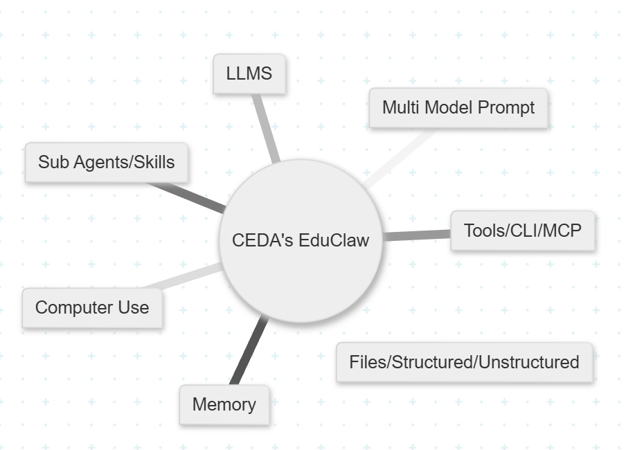
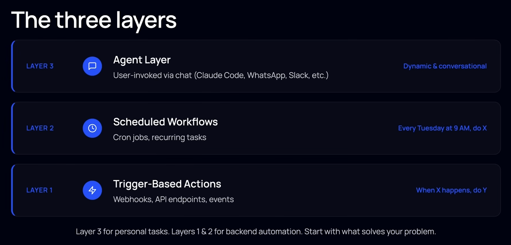
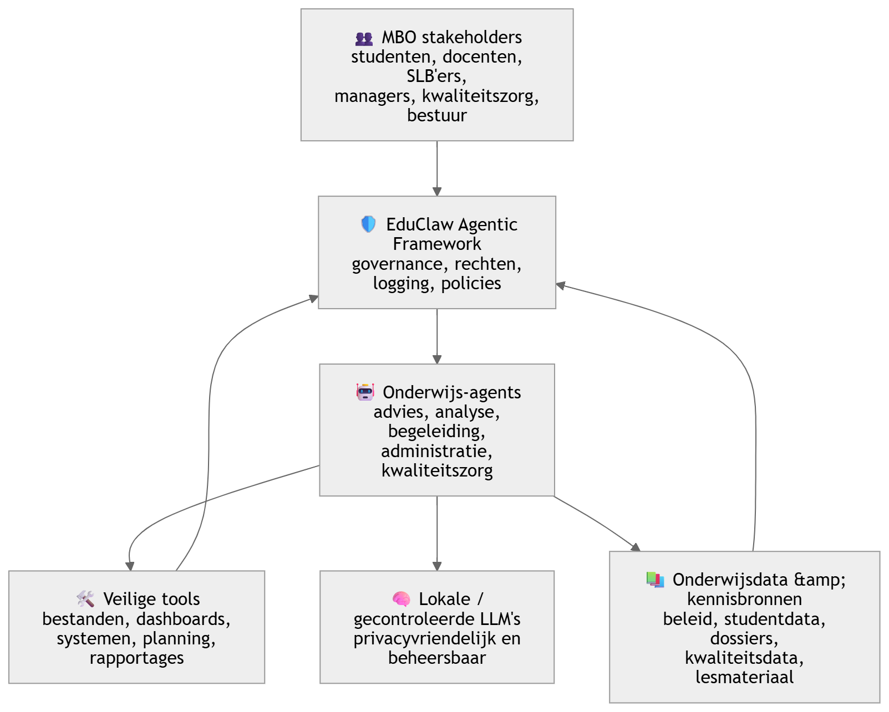
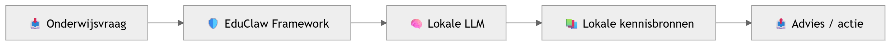
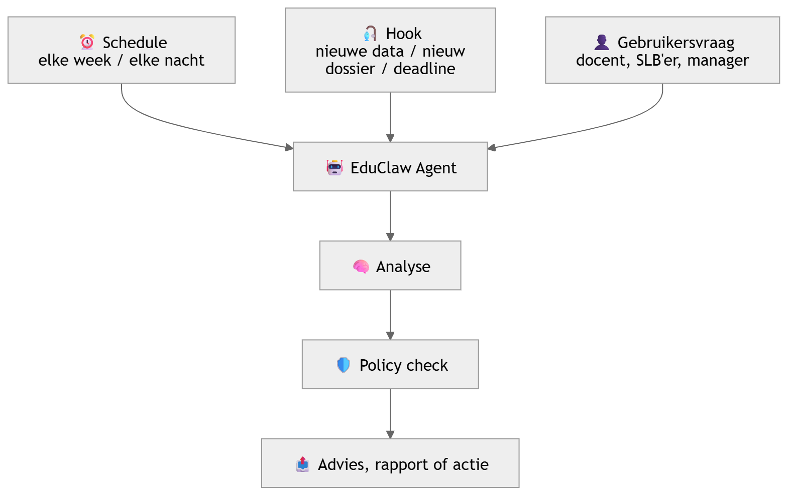
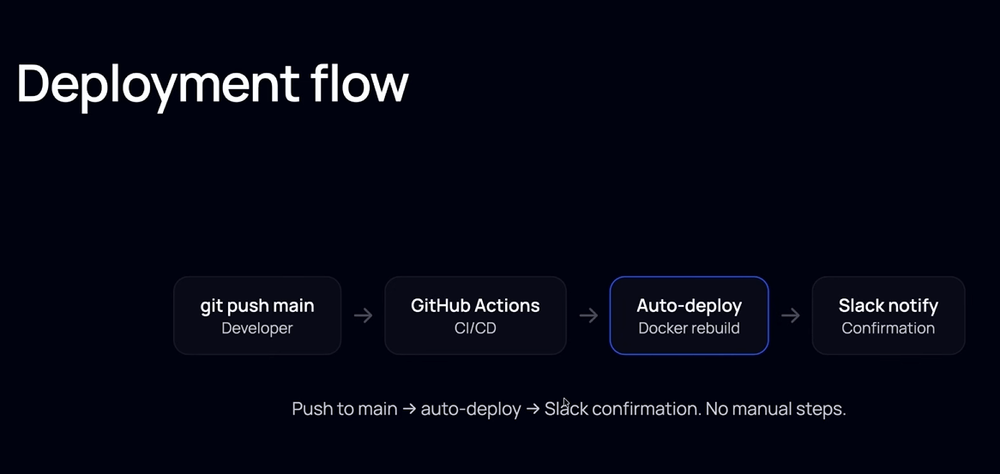

## EduClaw hoog-over architectuur

EduClaw kun je positioneren als:

> 
> **Een veilig agentic framework voor het onderwijs, waarin AI-agents zelfstandig taken kunnen uitvoeren, maar altijd binnen gecontroleerde kaders.**

Het verschil met “Agents of Chaos” is precies dit: daar kregen agents autonomie met tools zoals geheugen, e-mail, Discord, bestanden en shell-toegang, en dat leidde tot risico’s zoals ongeautoriseerde acties, datalekken, destructieve systeemacties en foutieve succesrapportages. 

* * *

## Van chaos naar controle

* * *

## De kernlagen van EduClaw

* * *

## Wat EduClaw anders doet

### 1. 🤖 Agents mogen handelen, maar niet zomaar alles

Een EduClaw-agent kan bijvoorbeeld:

- een rapport voorbereiden
- studentinformatie samenvatten
- een SLB’er adviseren
- een kwaliteitsanalyse maken
- een lesvoorstel genereren
- een proces bewaken

Maar altijd via:

> 
> **rechten, rollen, policies en logging**

Dus niet: “de agent mag overal bij”.  
Wel: “de agent mag alleen doen wat past bij zijn taak, rol en context.”

* * *

### 2. 🛡️ Het framework is de harnaslaag

![educlaw_harnas]src/assets/educlaw_harnas.png)
EduClaw is niet alleen een AI-model.  
Het is vooral een **harnessed framework**:

De agent zit dus niet los in het systeem, maar werkt **in een kooi met slimme hekken**.

* * *

## 3. 🧠 Lokale LLM’s als veilige motor

EduClaw kan werken met lokale of gecontroleerde LLM’s:

Voordeel:

- gevoelige onderwijsdata blijft beter beheersbaar
- minder afhankelijkheid van externe platforms
- beter passend bij publieke waarden
- geschikt voor MBO-context met privacygevoelige processen

* * *

## 4. 🔁 Agents werken autonoom via hooks en schedules

EduClaw-agents wachten niet alleen op een vraag.  
Ze kunnen ook automatisch starten:

Voorbeelden:

- elke maandag automatisch risicosignalen voorbereiden
- bij nieuwe enquêtegegevens een teamrapport maken
- bij afwijkende voortgang een SLB’er waarschuwen
- periodiek kwaliteitsdata samenvatten voor management

* * *

## Deployment Flow

## Hoog-over pitch

> 
> **EduClaw is een veilig agentic AI-framework voor het Onderwijs. Het geeft AI-agents de mogelijkheid om zelfstandig onderwijsprocessen te ondersteunen, maar binnen duidelijke grenzen: lokaal waar mogelijk, gecontroleerd via policies, transparant via logging en altijd afgestemd op rollen en verantwoordelijkheden.**

Of nog korter:

> 
> **EduClaw verandert AI-agents van potentiële “agents of chaos” in gecontroleerde digitale collega’s voor het Onderwijs.**

