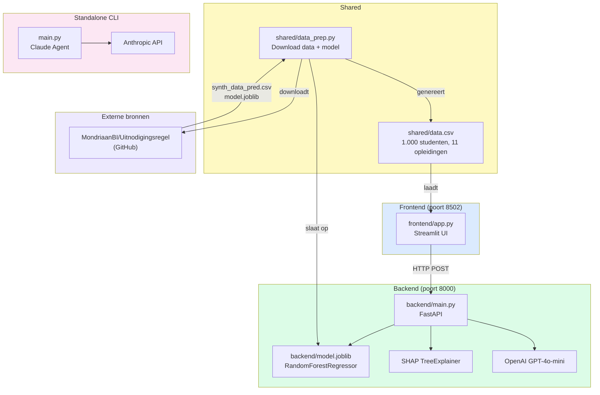
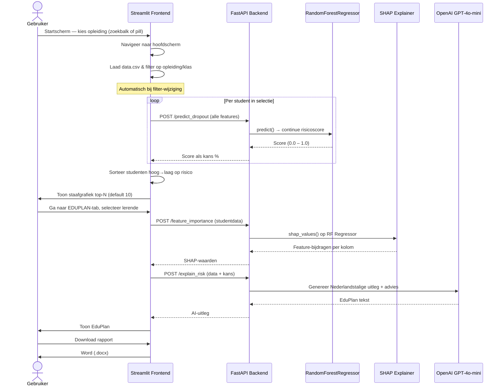

# EduPulse — Architectuur & Flow

## 1. Architectuur



---

## 2. Flow & werking



---

## 3. Schermstructuur

```
Startscherm
├── Zoekbalk + START-knop
├── Snelkeuze-pills (4 zichtbaar + "Meer ↓")
└── Footer (CC-licentie)

Hoofdscherm
├── Header: CEDA | UITNODIGINGSREGEL  EDUPLAN  (roze achtergrond, schaduw)
├── Witte kaart
│   ├── Kaart-header: [Opleiding]  [KLAS: ...]  [✏]
│   ├── Terracotta banner: "Toon mij X lerenden…" + slider
│   ├── Tab UITNODIGINGSREGEL → horizontale staafgrafiek
│   └── Tab EDUPLAN → student-selector + TOON EDUPLAN + EduPlan-kaart
│       └── PRINT  DOWNLOAD (.docx)
└── Footer (CC-licentie)
```
