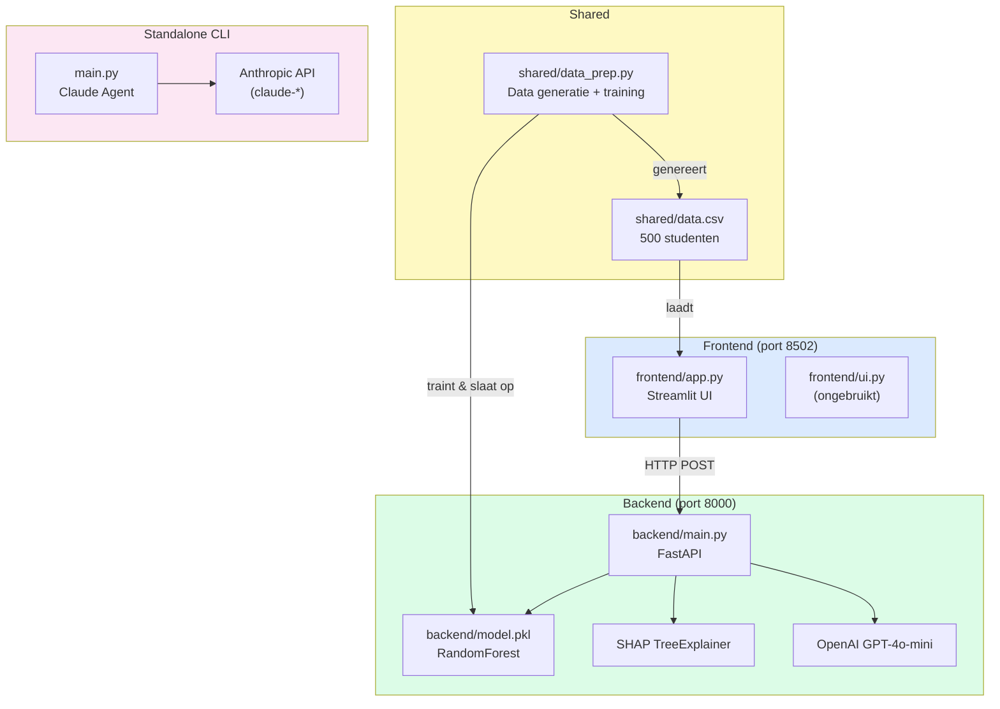
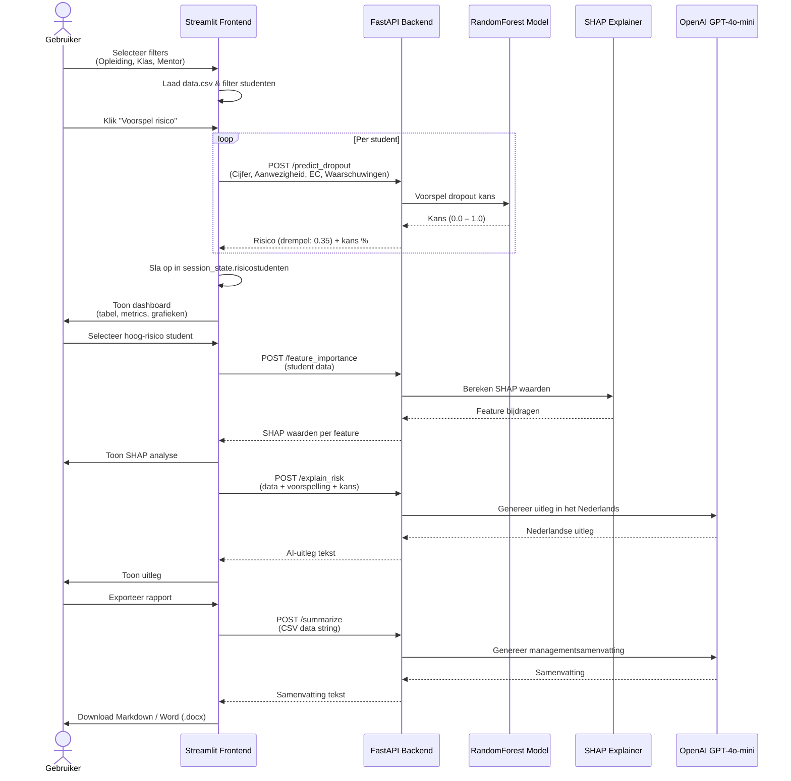

# EduPulse — Architectuur & Flow

## 1. Architectuur

```mermaid
graph TB
    subgraph Frontend["Frontend (port 8502)"]
        APP["frontend/app.py<br/>Streamlit UI"]
        UI["frontend/ui.py<br/>(ongebruikt)"]
    end

    subgraph Backend["Backend (port 8000)"]
        API["backend/main.py<br/>FastAPI"]
        MODEL["backend/model.pkl<br/>RandomForest"]
        SHAP["SHAP TreeExplainer"]
        OPENAI["OpenAI GPT-4o-mini"]
    end

    subgraph Shared["Shared"]
        DATA["shared/data.csv<br/>500 studenten"]
        PREP["shared/data_prep.py<br/>Data generatie + training"]
    end

    subgraph Standalone["Standalone CLI"]
        MAIN["main.py<br/>Claude Agent"]
        ANTHROPIC["Anthropic API<br/>(claude-*)"]
    end

    APP -->|"HTTP POST"| API
    API --> MODEL
    API --> SHAP
    API --> OPENAI
    PREP -->|genereert| DATA
    PREP -->|traint & slaat op| MODEL
    DATA -->|laadt| APP
    MAIN --> ANTHROPIC

    style Frontend fill:#dbeafe
    style Backend fill:#dcfce7
    style Shared fill:#fef9c3
    style Standalone fill:#fce7f3
```

---

## 2. Flow & werking

```mermaid
sequenceDiagram
    actor Gebruiker
    participant FE as Streamlit Frontend
    participant BE as FastAPI Backend
    participant RF as RandomForest Model
    participant SHAP as SHAP Explainer
    participant GPT as OpenAI GPT-4o-mini

    Gebruiker->>FE: Selecteer filters<br/>(Opleiding, Klas, Mentor)
    FE->>FE: Laad data.csv & filter studenten

    Gebruiker->>FE: Klik "Voorspel risico"
    loop Per student
        FE->>BE: POST /predict_dropout<br/>(Cijfer, Aanwezigheid, EC, Waarschuwingen)
        BE->>RF: Voorspel dropout kans
        RF-->>BE: Kans (0.0 – 1.0)
        BE-->>FE: Risico (drempel: 0.35) + kans %
    end

    FE->>FE: Sla op in session_state.risicostudenten
    FE->>Gebruiker: Toon dashboard<br/>(tabel, metrics, grafieken)

    Gebruiker->>FE: Selecteer hoog-risico student
    FE->>BE: POST /feature_importance<br/>(student data)
    BE->>SHAP: Bereken SHAP waarden
    SHAP-->>BE: Feature bijdragen
    BE-->>FE: SHAP waarden per feature
    FE->>Gebruiker: Toon SHAP analyse

    FE->>BE: POST /explain_risk<br/>(data + voorspelling + kans)
    BE->>GPT: Genereer uitleg in het Nederlands
    GPT-->>BE: Nederlandse uitleg
    BE-->>FE: AI-uitleg tekst
    FE->>Gebruiker: Toon uitleg

    Gebruiker->>FE: Exporteer rapport
    FE->>BE: POST /summarize<br/>(CSV data string)
    BE->>GPT: Genereer managementsamenvatting
    GPT-->>BE: Samenvatting
    BE-->>FE: Samenvatting tekst
    FE->>Gebruiker: Download Markdown / Word (.docx)
```
