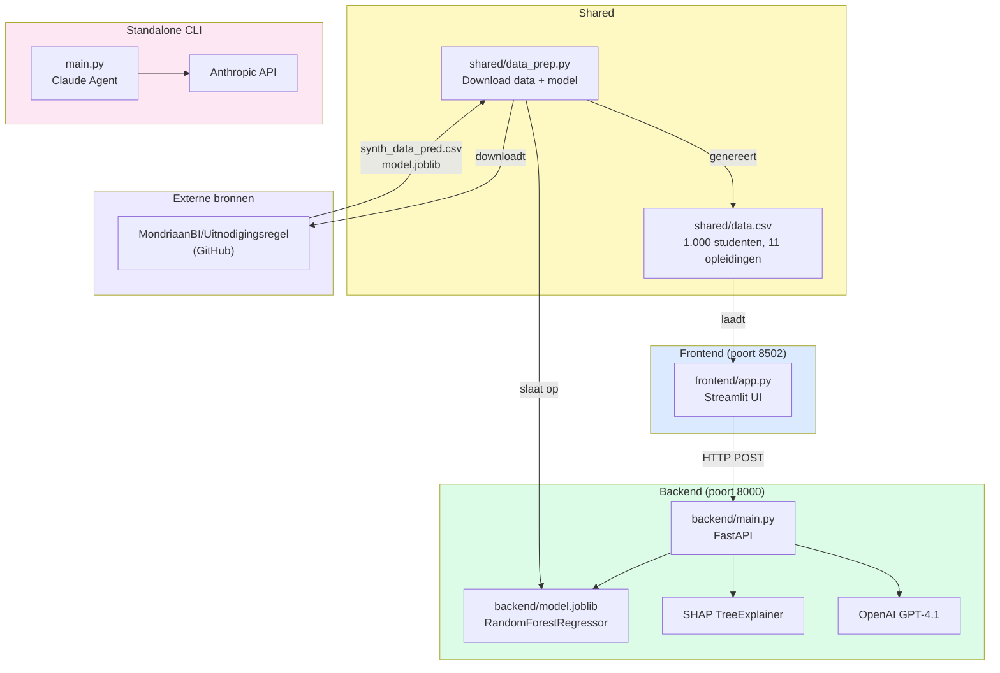
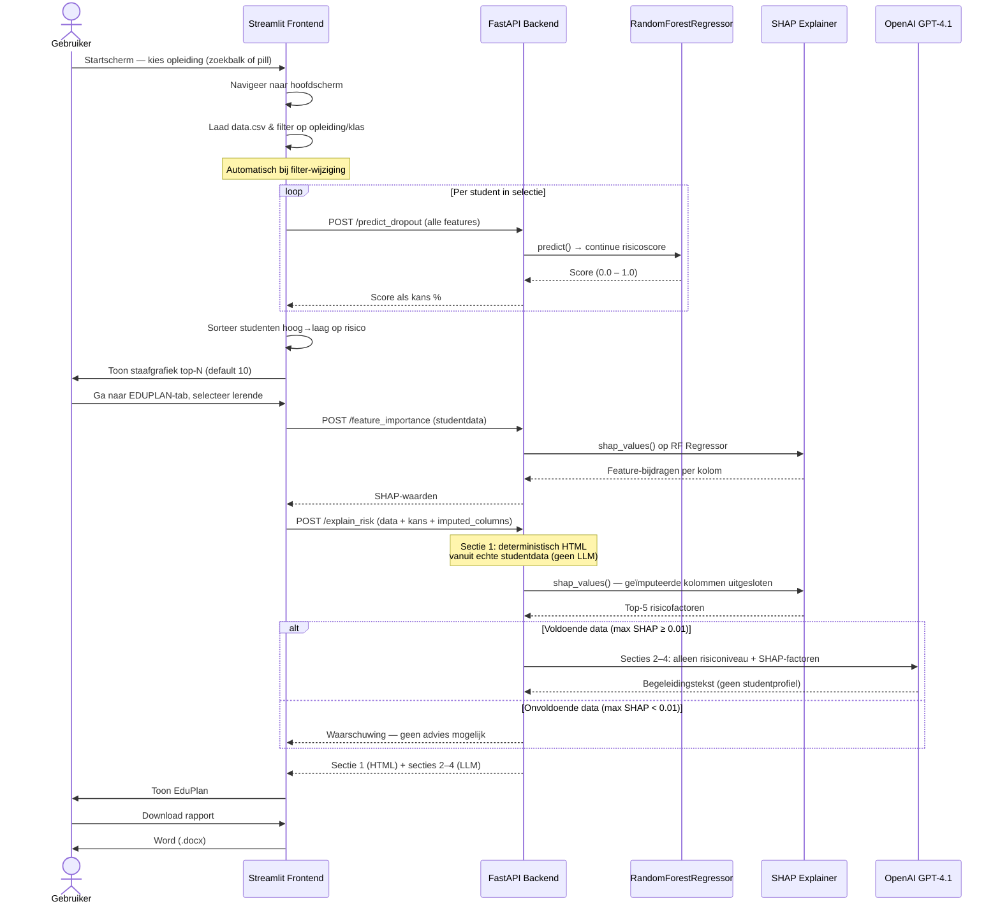

# EduPulse — Architectuur & Flow

## 1. Architectuur



---

## 2. Flow & werking



---

## 3. Schermstructuur

```
Startscherm  (roze achtergrond #f0d4d4)
├── Upload-veld (.csv / .xlsx) — auto-detectie scheidingsteken
├── Demo-data checkbox
├── START DE UITNODIGINGSREGEL knop
├── Snelkeuze-pills (4 zichtbaar + "Meer ↓")
└── Footer — compact, roze, sticky onderaan

Hoofdscherm  (roze achtergrond #f0d4d4)
├── Header (lichtroze #fae8e8, sticky, schaduw)
│   ├── CEDA  (logo links)
│   └── [← TERUG]  [UITNODIGINGSREGEL*]  [EDUPLAN]  (knoppen rechts)
│       * actieve tab heeft witte achtergrond + zwarte rand
├── Witte kaart
│   ├── Kaart-header: [Opleiding]  [KLAS: ...]  [✏]
│   ├── Terracotta banner: "Toon mij X lerenden…" + slider (default 10)
│   ├── Tab UITNODIGINGSREGEL → horizontale staafgrafiek (hoog→laag)
│   └── Tab EDUPLAN → student-selector + TOON EDUPLAN + EduPlan-kaart
│       ├── Sectie 1: deterministisch risicoprofiel (HTML, geen LLM)
│       │   └── Ontbrekende kolommen getoond als "niet beschikbaar"
│       ├── Secties 2–4: AI-begeleidingstekst (GPT-4.1)
│       └── PRINT  DOWNLOAD (.docx)
└── Footer — compact, lichtroze (#fae8e8), sticky onderaan
    © 2026 CEDA — CC BY-SA 4.0
```
